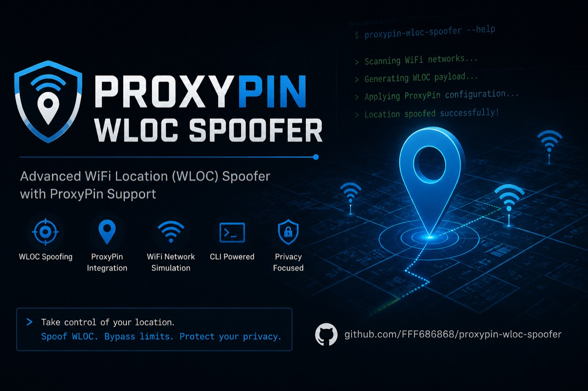
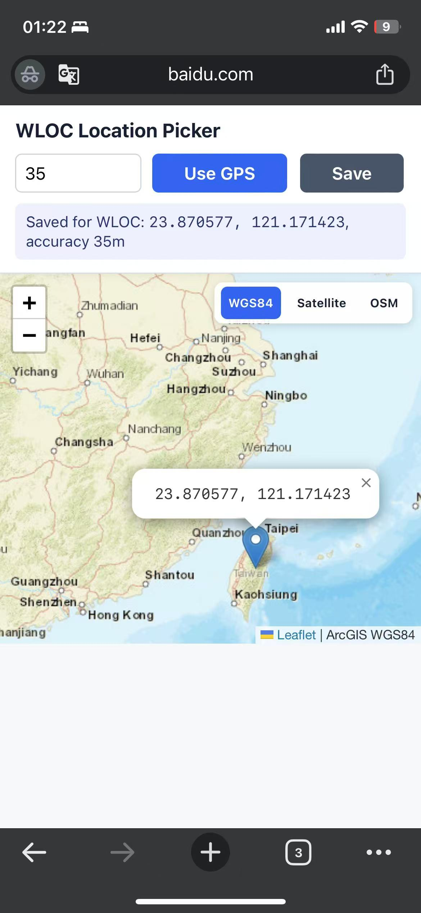

<h1 align="center">ProxyPin WLOC 响应重写脚本</h1>

<p align="center">
  
</p>

<p align="center">
  中文 · <a href="README.md">English</a>
</p>

<p align="center">
  <a href="https://github.com/FFF686868/proxypin-wloc-spoofer/stargazers"></a>
  <a href="https://github.com/FFF686868/proxypin-wloc-spoofer/network/members"></a>
  <a href="LICENSE"></a>
  <a href="https://github.com/wanghongenpin/proxypin"></a>
  <a href="https://linux.do"></a>
</p>

这是一个用于授权 iOS 定位测试的 ProxyPin 脚本。它拦截 Apple WLOC
接口响应：

- `gs-loc-cn.apple.com/clls/wloc`
- `gs-loc.apple.com/clls/wloc`

然后在原始二进制响应包里替换经纬度字段。

这不是 Apple CVE，不是远程漏洞，也不是 iOS 权限绕过。它只能在用户主动安装并信任
ProxyPin CA 证书、并让设备流量经过 ProxyPin 的测试环境里生效。

## 免责声明

本项目仅用于授权测试、安全研究和 QA 场景复现。

使用本项目即表示你理解并同意：

- 只能测试你自己拥有，或已获得明确授权的设备、应用、账号和网络。
- 你需要自行遵守所在地法律法规、平台规则和服务条款。
- 作者不对任何滥用行为、服务违规、账号封禁、数据损失、法律后果或其他损害负责。
- 本项目按“原样”提供，不提供任何形式的担保。

不要使用本项目欺骗服务、绕过规则、伪造生产环境定位数据，或在未经授权的设备和网络上使用。

## 功能

- 保留原始 WLOC 二进制请求体，避免 ProxyPin 把 body 重编码坏。
- 支持 gzip 压缩的 WLOC 响应。
- 在原始响应包结构中替换经纬度。
- 通过响应头输出调试信息，例如：
  - `X-WLOC-ProxyPin`
  - `X-WLOC-Origin-Status`
  - `X-WLOC-Patched-Locations`
  - `X-WLOC-Error`

## 使用前提

本仓库只是一个给 ProxyPin 使用的 JavaScript 脚本，不是独立 App、代理服务器或 iOS 描述文件。

你需要准备：

- 支持脚本功能的 ProxyPin。
- 一台 iOS 测试设备。
- 在测试设备上安装并信任 ProxyPin CA 证书。
- 在 ProxyPin 中开启 HTTPS 抓包。

## 文件

- `proxypin_wloc_compat_v2.js`：ProxyPin JavaScript 脚本。
- `proxypin-scripts.json`：ProxyPin 可导入的脚本配置文件，已包含脚本和匹配规则。
- `leaflet-test.html`：本地浏览器使用的 Leaflet 测试页面。
- `LICENSE`：MIT 许可证。
- `NOTICE`：pako 第三方库说明。

## 使用方法

请在 ProxyPin 里使用本地脚本，不建议使用远程 URL 脚本。

完整图文教程请看：[ProxyPin WLOC 响应重写脚本图文教程](docs/zh-CN/tutorial.md)。

### 导入 JSON

1. 在 ProxyPin 中打开脚本管理页面。
2. 导入 `proxypin-scripts.json`。
3. 确认导入后的脚本已启用。
4. 确认已开启 HTTPS 抓包，并且测试设备已信任 ProxyPin CA。
5. 在走代理的设备上打开 `https://www.baidu.com/`。
6. 在 Leaflet 地图中选择位置，然后点击 `Save`。
7. 触发 iOS 系统定位。

<p align="center">
  
</p>

导入文件已经包含以下匹配规则：

   - `www.baidu.com/*`
   - `gs-loc-cn.apple.com/clls/wloc`
   - `gs-loc.apple.com/clls/wloc`

### 手动新建脚本

如果不想导入 JSON：

1. 打开 `proxypin_wloc_compat_v2.js`。
2. 复制完整脚本内容。
3. 在 ProxyPin 中新建本地脚本。
4. 匹配上面列出的 URL。
5. 把脚本粘贴到 ProxyPin。

正常情况下，WLOC 响应头应出现：

```text
X-WLOC-ProxyPin: v5.4.2
X-WLOC-Origin-Status: 200
X-WLOC-Patched-Locations: 大于 0
```

如果看到：

```text
X-WLOC-Origin-Status: 400
```

说明 Apple 服务端拒绝了原始请求，脚本还没机会修改有效响应。

## 修改坐标

推荐方式是在 `https://www.baidu.com/` 打开 Leaflet 选点页面，选择位置后点击 `Save`。
坐标会保存到 ProxyPin 的 `context.session`，后续 WLOC 响应会自动使用该坐标。

如果还没有保存过坐标，脚本会使用以下默认值：

```js
var TARGET_LONGITUDE = 113.94114;
var TARGET_LATITUDE = 22.544577;
var TARGET_ACCURACY = 25;
```

## 适用范围

本项目仅用于：

- 授权设备测试。
- QA 定位场景复现。
- 本地代理环境下的安全研究。

## 限制

这个脚本修改的是 Apple 网络定位 WLOC 响应，不是直接修改 GPS 硬件读数。
当 GPS 信号强时，iOS 可能优先采用真实 GPS。

## 引用

- ProxyPin 项目：<https://github.com/wanghongenpin/proxypin>
- ProxyPin 脚本文档：<https://github.com/wanghongenpin/proxypin/wiki/Script>
- pako gzip 库：<https://github.com/nodeca/pako>
